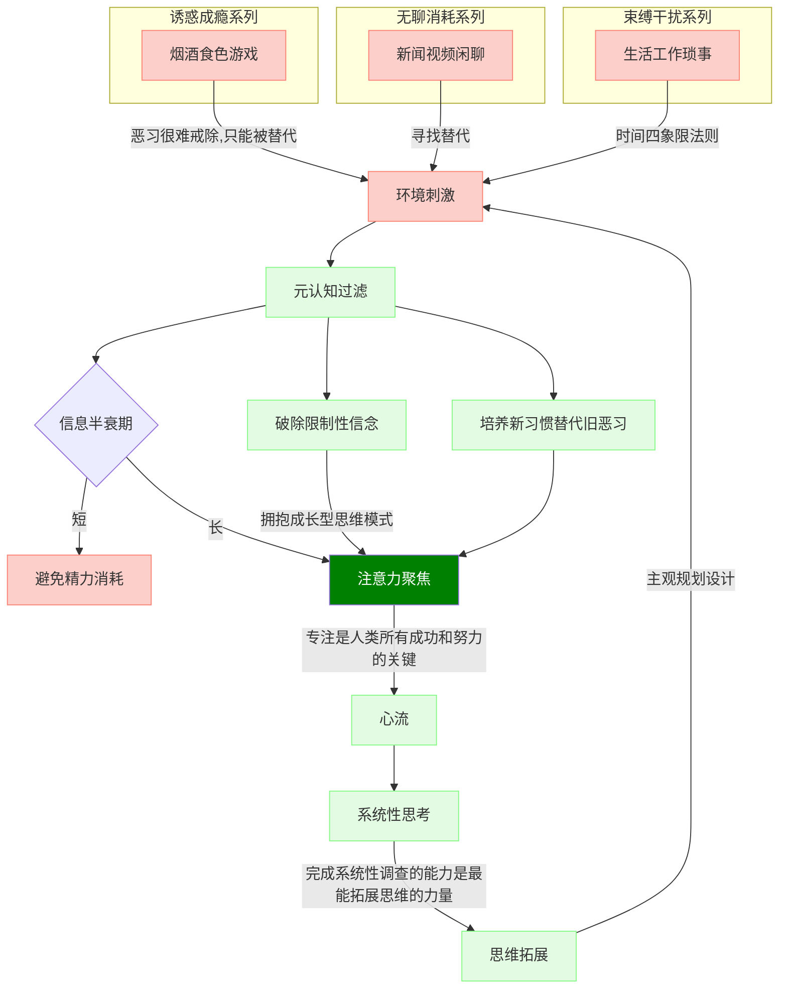

关于我、世界及意义。

---

- 以解决现实问题为导向的思维架构者  
- 探究世界的运转原理  
- 探索人的无限可能性  

---

人只能活在自己的意识中，认知是外在在内心的映射。  

你必须看到这个世界真实的样子，而不是你以为的样子、或者你希望的样子，只有这样你才能做出正确的选择。

注意力是唯一可交换的资本，把注意力转化成认知。
塑造认知的过程，在于抵御红色负能量的侵蚀，强化绿色能量流的正向反馈。  

本博客研究的是，在实现进入绿色轨道之后，着重探索从系统性思考到思维拓展这段路径，记录过程及结果，体现为对事物结构的原理分析、解决问题的方法运用、思维模型设计、思维框架搭建及思维架构的灵活重组。

---

- 结构  
结构化思维的核心特征就是——联系。清楚理解事物由几部分组成，各部分之间是如何联系的。本质是逻辑，将零散的数据、信息、知识、思维等有机组织起来。

- 方法  
方法是研究的手段，归纳演绎、抽象具体等辩证  
自学的关键是用自己的话讲(写)出来

- 模型  
模型是对规律的总结

- 框架  
框架是思维的脚手架，是具体反复可用的

- 架构  
架构是平衡利弊的决策

<svg xmlns="http://www.w3.org/2000/svg" version="1.1" class="gradient">
  <defs>
    <linearGradient id="grad1" x1="0%" y1="0%" x2="100%" y2="0%">
      <stop offset="0%" style="stop-color:#ffadbc;stop-opacity:1" />
      <stop offset="100%" style="stop-color:#a2fba2;stop-opacity:1" />
    </linearGradient>
  </defs>
  <ellipse cx="200" cy="70" rx="85" ry="55" fill="url(#grad1)" />
</svg>

