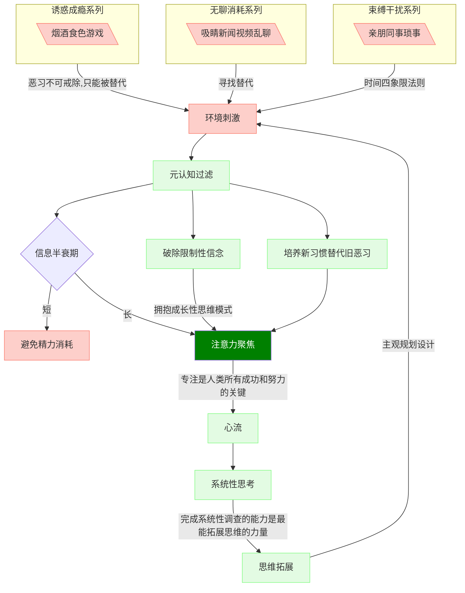

关于我、世界及意义。

---

- 以解决现实问题为导向的思维架构者  
- 探究世界的运转原理  
- 成为自己想成为且致力于成为的样子  

---

人只能活在自己的世界中，认知是外在在内心的映射。

我勾勒的认知模型，在于抵御红色负能流的侵蚀，强化绿色能流的正向反馈。  

本博客着重记录的是，系统性思考到思维拓展这段路径的过程及结果，结果体现为对事物结构、解决问题的方法、思维模型、思维框架及灵活调整的思维架构的学习及运用。

#### 注意力
注意力是唯一可交换的资本  
专注是人类所有成功和努力的关键

#### 结构  
结构化思维的核心特征就是——联系。清楚理解事物由几部分组成，各部分之间是如何联系的。本质是逻辑，将零散的数据、信息、知识、思维等有机组织起来。

#### 方法  
#### 模型  
#### 框架  
#### 架构  

