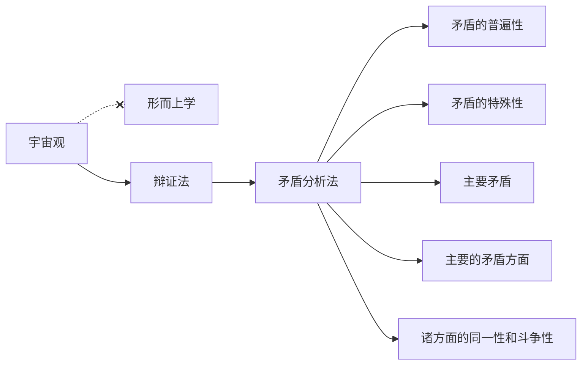

到底是什么决定了我们的认识，是某个已故或在世的人的思想？是某群学科的

价值 === 成长

朋友|敌人
---|---
价值（成长）|价格
需求|供给
我司|同行
收入|支出

整体有胜算，不要求面面俱到。  

什么是军事：打的赢就打，打不赢就跑。  
怎么打：十个打一个，唯一正确的方法就是集中兵力打。  
什么是政治：把支持我们的人搞得多多的，把反对我们的人搞的少少的。  
什么是宣传：让大家觉得咱们好，别人不好。  

## 指数思维
线性思维是让事情变得更好，指数思维是让事情变得不同。

第一步，找到根本问题。  
第二步，提出新方法。  
第三步，阅读相关信息，阅读是最能解放大脑的活动，通过阅读全面认识，实现认知飞跃。  
第四步，进行外推。假设各种实现方案，你看到的弯道也许不能顺利直线前行，速度也慢，但是达到即是指数变化。
