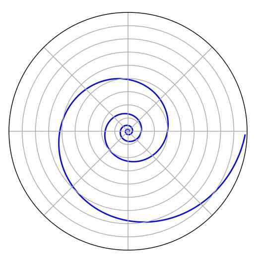

### 线性思维

### 周期思维
周期思维用来择时。   
在对的时间遇见对的人，在正确的时间区域配置正确的资产。  
现金、债券、股币、商品四类研究比较，研究不能解决未来会发生，未来是随机的，研究的价值是能够让你搞清楚你现在所处位置的胜算概率。   
比如现在是QT的第一个月，现金比股币(美)要有价值。            

对于宏观只需要了解趋势，不需要也不可能精准量化，但是要判断概率。  

- 世界第一周期
美联储的QT、QE
量化紧缩和量化宽松，叠加加息和降息
- 周期

### 指数思维
第一步，找到根本问题。  
第二步，提出新方法。  
第三步，阅读相关信息，阅读是最能解放大脑的活动，通过阅读全面认识，实现认知飞跃。  
第四步，进行外推。假设各种实现方案，你看到的弯道也许不能顺利直线前行，速度也慢，但是达到即是指数变化。

### 自然思维
这个世界的运行路径也许就是e——自然常数。自然律的表达是＂螺线＂。
> 自然并非大自然，是天然、天生如此的意思。  

$$ 
e = \lim_{n \to \infty} (1+\frac{1}{n} )^n
$$

e表达的是复制自我、一轮周期的速度极限。

坐标系的中心，深深的望下去，就如回望历史，所在的二维平面即是当下，越出平面之上的是未来。  
这条螺线，展现了周期的样子，也说明周期只会相似而不是重复，时间的滚滚之轮永远向前。  

