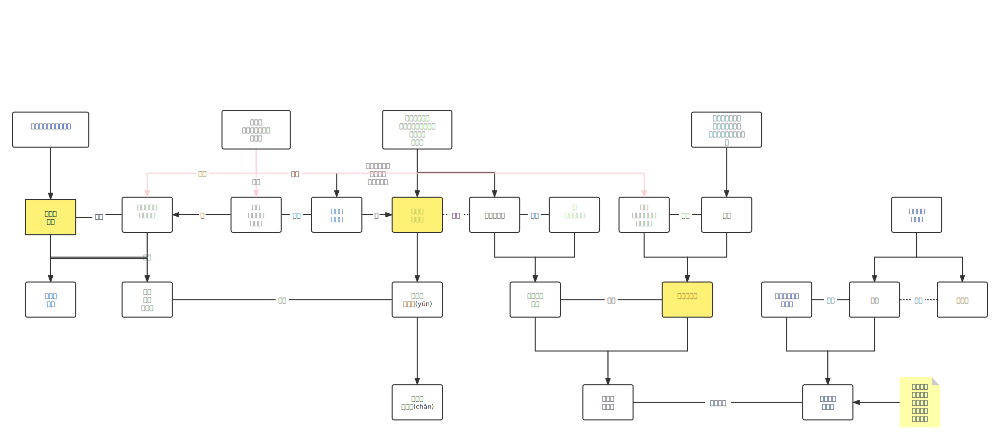

大唐王朝，是中国泱泱五千年历史最辉煌的鼎盛时期，海纳百川，气象万千；山河浩荡，锦绣文章，留给后世一卷挥戈横戟的帝国风云。
开创贞观盛世的唐太宗李世民，智慧超群、贤惠雍容的文德皇后长孙氏，于隋唐之际的金戈铁马、风云际会中，携手一生，至死不渝；
铁血与柔情，江山与痴心，盛世明君与千古贤后，相濡以沫二十三载，携手挥就缱绻情深的帝后传奇。

其实李世民不用说自己想问津皇位，当他的才能倾倒身边越来越多的人之后，自然会有人就不断鼓动他那个位置一步步靠近。长孙氏也明白丈夫的心思，虽不说，却在关键时候用自己羸弱的肩膀为李世民撑起一片温暖。直到“玄武门之变”爆发。一直站在丈夫身后的长孙氏毫无例外地出现在了丈夫身旁，从容勉励将士。将士们无不感激秦王妃的亲自慰勉，因此更奋发无畏。妻子无所畏惧地生死相随不离不弃，更激励着丈夫李世民。在唐书后妃列传中，有这样一句话“太宗在玄武门，方引将士入宫授甲，后亲慰勉之，左右莫不感激。”

这一对称得上青梅竹马小夫妻，并没有享受太多郎情蜜意新婚生活，却在多变的政治局面里铸就了牢不可破的感情。李世民对待长孙氏的态度也是如此，成则同上九重天，败则同坠地狱，无论生死富贵，都要和妻子共同面对。
那一年，盛年的太宗忽然病重，长孙氏虽然贵为皇后，仍然衣不解带的侍奉太宗。她飘飘的衣带上时刻都系着毒药，被太宗发现后，她平静的解释“若有不为，义不独生。”这一刻，跟李世民领她去玄武门的心情是否遥相呼应。

或许这毒药才是长孙氏深入骨髓的痴情的真实表达。

贞观十年，长孙氏病危，奄奄一息与唐太宗李世民诀别，说道：“玄龄久事陛下，预奇计密谋，非大故，愿勿置也。妾家以恩津进，无德而禄，易以取祸，无属枢柄，以外戚奉朝请足矣！妾生无益于时，死不可以厚葬，愿因山为垅，无起坟，无用棺椁，器以瓦木，约费送终，是妾不见忘也。”

这年六月，长孙氏去世，三十六岁。
“坤厚载物，德合无疆。”这八个字长孙氏用短暂的一生已经诠释的完美无瑕。可惜太宗在长孙氏去世后才发现她亲手编纂的《女则》十卷。这书完全是长孙氏采古代妇人事迹，用来鞭策自己用的。彼时太宗才发现这个默默支持自己的女人经历了怎么样的孤单和清冷。

李世民看了，悲伤不已，拿着这《女则》对大臣们说:“后此书可用垂后，我岂不通天命而割情乎！顾内失吾良佐，哀不可已已！”在睹物思人的哀伤中，太宗后宫里所有活着的女人，都抵不过死去的长孙氏。从此大唐王朝再没有皇后。

李世民的故事非常传奇，18岁跟着父亲起兵，19岁封秦王，20岁到24岁征战四方，薛举、刘武周、王世充窦建德，三战灭四国，帮助大唐一统中原。武德后期两次身处险境“骗”突厥退兵。之后就是凡了解一点历史都耳熟能详的玄武门之变和贞观之治。28岁登基，51岁逝世，在位23年。这个人既没有年轻时的蹉跎，如刘邦朱元璋那样的厚积薄发，亦没有晚年的昏聩，比如汉武帝唐玄宗。少年成名，刚至暮年即结束，一生都光彩夺目，干脆利落。以事业而论，无有遗憾，令人心折。作为李世民的皇后，长孙也几乎是这样，名门望族之后，13岁嫁给唐国公的二公子，陪着李世民一道太原起兵，入主长安。秦王一路的征程均有她的参与，除了没有一起上战场。文学馆有她的身影，玄武门有她的身影，25岁为后，36岁逝世。美人尚未迟暮，身后三子四女，纷争未起，长孙家荣宠至极，其实走在最好的时候。
长孙皇后盛年而逝，留给丈夫、儿女的是无尽深重的哀痛。唐太宗面对妻子的离世悲恸万分，诸位皇子公主也悲伤异常，尤其是晋王李治，哀慕感动了周围的人，唐太宗亦十分心疼，于是做出了令世人瞩目的举动：亲自抚养了长孙皇后的一双儿女晋王李治与晋阳公主，成为了中国历史上第一位亲自抚养皇子的皇帝，也是唯一一位亲自抚养公主的皇帝！

唐太宗又因为十分思念妻子，在上苑中建了层观以登高眺望昭陵。一次，唐太宗和魏征一起登上层观，唐太宗指着昭陵让魏征看，魏征则回答说：“臣老眼昏花，看不清，臣以为陛下是在让臣看献陵（唐高祖帝陵），如果是在看昭陵，那么臣看到了。”唐太宗闻言潸然泪下，不得不毁掉了层观。在这个以孝为先、“夫不祭妻”的时代里，唐太宗如此张扬的思念妻子被魏征嘲弄讥讽也是理所当然的，但唐太宗对爱妻的思念却并没有因此而停止，反而越发汹涌难以自控，以至于他在一次给魏征的回诏中，公然向大臣倾诉说起了自己丧偶之后的悲苦心情——“顷年以来祸衅既极，又缺嘉偶，荼毒未几，悲伤继及。凡在生灵，孰胜哀痛，岁序屡迁，触目摧感。自尔以来，心虑恍惚，当食忘味，中宵废寝”。如此一字一血泪，当真令人唏嘘不已。贞观十四年，唐太宗将只有皇帝才能用的《光大之舞》定为祭祀长孙皇后时用的庙乐。按照惯例，只有当皇帝驾崩后，皇后才能跟随丈夫一同配享太庙，但唐太宗却早早将长孙皇后配享太庙，并且连指定的庙乐也是只有皇帝才能用的《光大之舞》——这需要唐太宗何等的深情与重视，才会让妻子与自己的祖先们一起享受同等级别的祭祀？

春游曲（长孙氏）
上苑桃花朝日明，兰闺艳妾动春情。
井上新桃偷面色，檐边嫩柳学身轻。
花中来去看舞蝶，树上长短听啼莺。
林下何须远借问，出众风流旧有名。

长孙皇后以林下自比，也许是夫妻欣赏品味相同，也许是受丈夫感染，心存向往。无论如何，短短八句诗里，看不见老成刻板的面孔，唯有春花烂漫，风格清雅，令人赏心悦目。

《资治通鉴》中这段有名的记载：

太宗葬文德皇后于昭陵，上念后不已，乃于苑中作层观，以望昭陵。尝引魏征同登，使视之，征熟视之曰：“臣昏毛，不能见。”上指示之，征曰：“以为陛下望献陵，若昭陵，则臣故见之矣。”上泣，为之毁观。

为了遥望追念亡妻，太宗在宫苑内造层观，不但自己望，还要让大臣望。魏征遵守那个时代的忠臣原则，故意不理会太宗的悼思，目的是劝谏皇帝及早从悲痛中走出，将心思放在国家大事上。太宗一辈子听魏征的忠言逆耳，当然懂得他的心思。然而，太宗哭了，英明神武如他，杀伐决断、佳丽无数，却终不舍发妻，为不得不遵守那个时代的原则而流泪。也许是愧对亡妻，也许是自叹身不由己，这一哭却哭出帝王的柔情。谁说帝王没有爱情？这就是最真挚的爱。

人死不能复生，任如何思念，终不能还魂与生者相伴。若要长相守，只有死后同穴。贞观二十三年，唐太宗病逝，死后与长孙皇后同葬昭陵，熬过了这些年的思念，终于可以在另一个世界相聚。不灭的魂灵宛如回到大婚之时，他正年轻，她正年少。

如果中国历史上只有一个“黄金时代”的话，就是贞观之治！
千古一后。

前无古人，后无来者。

