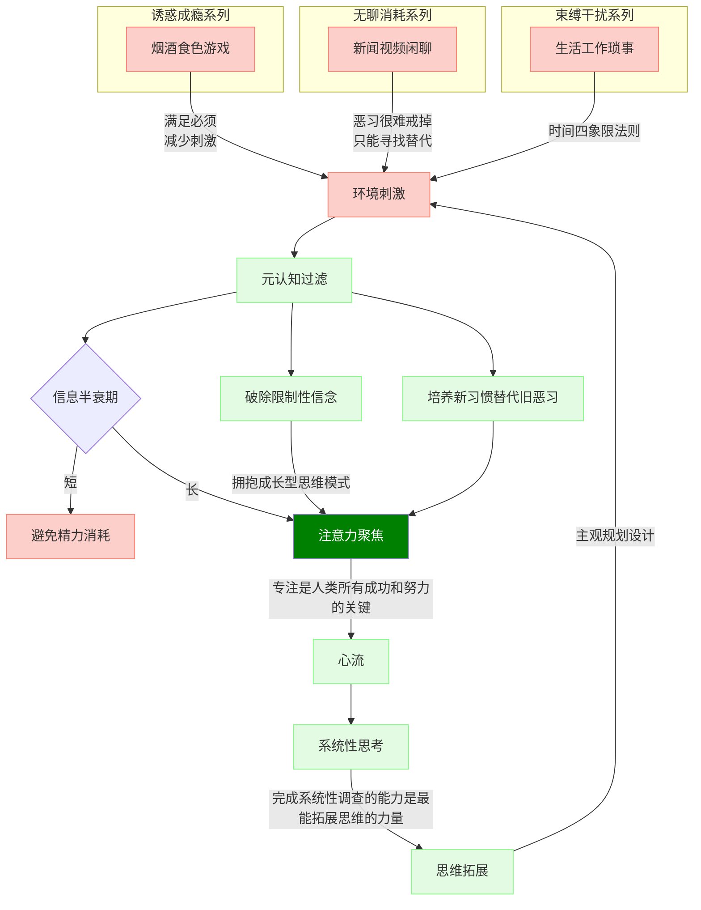

## 世界在每个人心中的映射都不一样
人只能活在自己的意识中，认知是外在在内心的映射。  
每个人看到的世界都不一样，随着认知提升和思维突破，同一个人看到的也会和以前不一样。  
你必须尽量看到这个世界真实的样子，而不是你以为的样子、或者你希望的样子，只有这样你才能做出正确的选择。

## 为什么要不遗余力的提升认知
当你朱颜辞镜、亲人渐远、身体衰退，唯一可凭依的也许只有智慧。  
提升认知，做正确的决策！
只求做正确的事，事情做对了，利润是水到渠成的。   
预测只是一个工具，对个体来说，最重要的是决策。万一不测的时候，我们能有对策。   
<a href="../决策/2022.md">每年做对一两个关键决策</a>

## 珍惜注意力
注意力是唯一可与外部交换的资本，把注意力转化成认知。
塑造认知的过程，在于抵御红色负能量的侵蚀，强化绿色能量流的正向反馈。  

人心惟危，道心惟微，惟精惟一，允执厥中。   
灵明无着，物来顺应，未来不迎，当时不杂，既过不恋。  

<svg xmlns="http://www.w3.org/2000/svg" version="1.1" class="gradient">
  <defs>
    <linearGradient id="grad1" x1="0%" y1="0%" x2="100%" y2="0%">
      <stop offset="0%" style="stop-color:#ffadbc;stop-opacity:1" />
      <stop offset="100%" style="stop-color:#a2fba2;stop-opacity:1" />
    </linearGradient>
  </defs>
  <ellipse cx="200" cy="70" rx="85" ry="55" fill="url(#grad1)" />
</svg>
