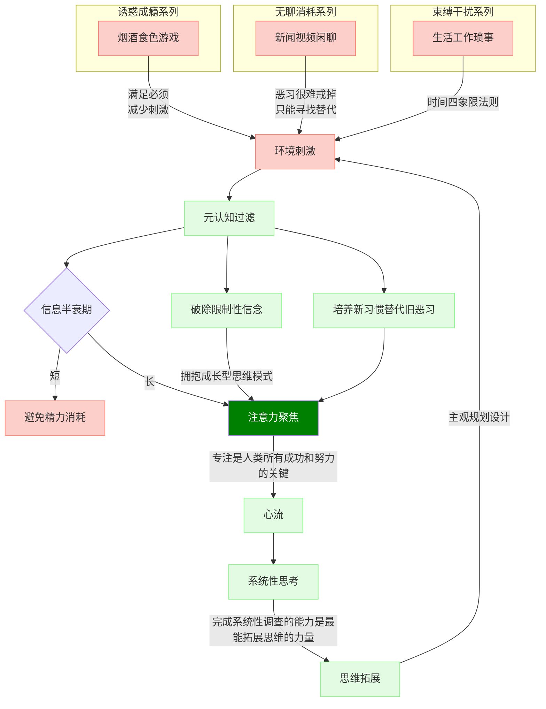

## 世界在每个人心中的映射都不一样
人只能活在自己的意识中，认知是外在在内心的映射。  
你必须尽量看到这个世界真实的样子，而不是你以为的样子、或者你希望的样子，只有这样你才能做出正确的选择。

## 为什么要不遗余力的提升认知
当你朱颜辞镜、亲人渐远、身体衰退，唯一可凭依的也许只有智慧。  
提升认知，做正确的决策！
只求做正确的事，事情做对了，利润是水到渠成的。   
预测只是一个工具，对个体来说，最重要的是决策。万一不测的时候，我们能有对策。   
[每年做对一两个关键决策](决策/关键决策.md)

## 珍惜注意力
注意力是唯一可与外部交换的资本，把注意力转化成认知。
塑造认知的过程，在于抵御红色负能量的侵蚀，强化绿色能量流的正向反馈。

吃喝拉撒性，是不可抗拒的生理需求，只能及时满足，无法克制。     
温饱则思淫欲，人类温饱在中国也才刚刚几十年，何况风险仍存。性的及时满足时代还尚远，属于难度最高的生理需求。  
性的难度在于牵涉到爱、婚姻、家庭。  
无爱之性是兽性。有爱之性对天赋灵性的人是高级追求，建立在爱上的性，难度超高，如果再牵涉到结婚、已婚、家庭，复杂度更高。   
所以性这个生理需求的结构如一个三棱锥。最顶端是性，底端托起它的是爱、婚姻、家庭。   
没有婚姻家庭则需要双向的爱，已难。如果有婚姻家庭，婚内爱需要双方细心维护，婚外爱则婚姻家庭必对抗。    

<svg xmlns="http://www.w3.org/2000/svg" version="1.1" class="gradient">
  <defs>
    <linearGradient id="grad1" x1="0%" y1="0%" x2="100%" y2="0%">
      <stop offset="0%" style="stop-color:#ffadbc;stop-opacity:1" />
      <stop offset="100%" style="stop-color:#a2fba2;stop-opacity:1" />
    </linearGradient>
  </defs>
  <ellipse cx="200" cy="70" rx="85" ry="55" fill="url(#grad1)" />
</svg>
